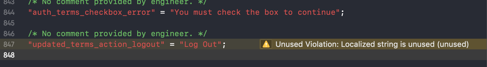
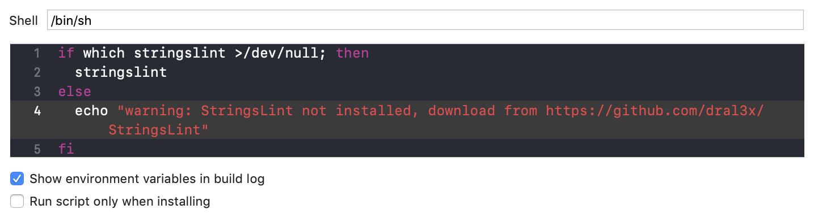

# StringsLint

A tool to ensure localized strings are complete and never unused.

StringsLint hooks into your source files, specifically it scans:

- .`strings`
- .`swift` and .`m`
- .`xib` and `.storyboard`




If you **found a bug** or **have a feature request**, please open an issue.
If you **want to contribute**, submit a pull request.


## Installation

### Using [Mint](https://github.com/yonaskolb/Mint):

```bash
mint install dral3x/stringslint
```

### Using [Homebrew](http://brew.sh/)

```bash
brew tap dral3x/dral3x
brew install stringslint
```

### Compiling from source:

You can build from source by cloning this project and running `make install` (Xcode 10.0 or later).

## Usage

### Xcode

Integrate StringsLint into an Xcode scheme to get warnings and errors displayed
in the IDE. Just add a new "Run Script Phase" with:

```bash
if which stringslint >/dev/null; then
  stringslint
else
  echo "warning: StringsLint not installed, download from https://github.com/dral3x/StringsLint"
fi
```




### Command Line

```
$ stringslint help
Available commands:

help            Display general or command-specific help
lint            Print lint warnings and errors (default command)
version         Display the current version of StringsLint
```

Run `stringslint` in the directory containing the files to lint.
Directories will be searched recursively.

## Rules

There are few basic but important rules included.
See [Rules.md](Rules.md) for more information.

You can also check [Sources/StringsLintFramework/Rules/Lint](Sources/StringsLintFramework/Rules/Lint) directory to see their implementation.

Each rule can emit violations. You can configure the severity of these violations (accepted values are `note`, `warning` and `error`).

When a violation with severity error is emitted, the Xcode build will fail.

### Configuration

Configure StringsLint by adding a `.stringslint.yml` file from the directory you'll run StringsLint from.
You can configure included and excluded file paths, extends some parsers capabilities and even turn off rules or specific files for each rule:

```yaml

included: # paths to include during linting. `--path` is ignored if present.
- Source
excluded: # paths to ignore during linting. Takes precedence over `included`.
- Carthage
- Pods
- Source/ExcludedFolder
- Source/ExcludedFile.swift
- Source/*/ExcludedFile.swift # Exclude files with a wildcard

# Customize parsers
objc_parser:
  implicit_macros:
    - SPKLocalizedString # detect this custom macro

xib_parser:
  key_paths:
    - textLocalized # keyPath used to localized UI elements

# Customize specific rules
missing:
  severity: error

partial:
  severity: warning

unused:
  severity: note
  ignored:
    - NSAppleMusicUsageDescription # used by iOS directly

```

## License

[MIT licensed.](LICENSE)
